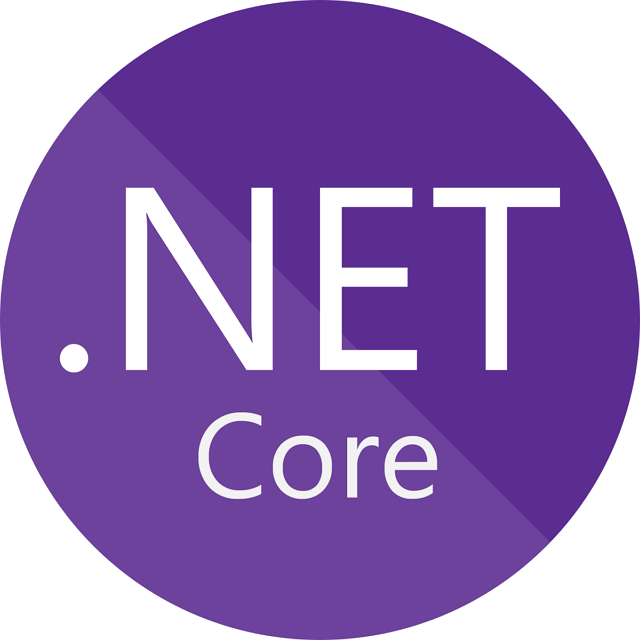

# Dotnet Core 5 & Multi Vue Pages Template

<p align="center">
    
</p>

## Table of Contents
- [About this project](#about-this-project)
- [Prerequisites](#prerequisites)

## About this project 
<p>This project are using the following packages:</p>
<p>這專案使用了以下套件</p>

### Front-end ( src/dotnetMultiVues.Web/client-app )
- [Axios](https://github.com/axios/axios) - Promise based HTTP client for the browser and node.js
- [Dayjs](https://day.js.org/) - Fast 2kB alternative to Moment.js with the same modern API
- [ESLint](https://eslint.org/) - Find and fix problems in your JavaScript code
- [Stylelint](https://stylelint.io/) - A mighty, modern linter that helps you avoid errors and enforce conventions in your styles.
- [TypeScript](https://www.typescriptlang.org/) - TypeScript extends JavaScript by adding types.
- [Vue 3](https://v3.vuejs.org/) - The Progressive JavaScript Framework.

### Back-end
- [RestSharp](https://restsharp.dev/) - Probably, the most popular REST API client library for .NET

## Prerequisites
<p>請先安裝好 Node.js & .NET 5.0 環境</p>

- [npm](https://www.npmjs.com/get-npm)
- [Node.js](https://nodejs.org/en/download/)
- [.Net 5](https://dotnet.microsoft.com/download/dotnet/5.0)

This Demo project is running on Node.js (12.22.1), NPM (6.14.12), ASP.NET Core Runtime(5.0.7).

## Clone / Download
1. Clone this repository to your local machine
2. Start your development :

```
$ git clone https://github.com/andy922200/dotnet-mvc-multi-vue-template.git
```

## Related Scripts
### Back-end
* Start the dev server
```
dotnet run
```
* Start the dev server and watch files
```
dotnet watch run // you could extend or remove watch type files in .csproj
```
* watch files but keep Vue in development mode 
```
env=dev dotnet watch run // This will be conflicted with 'npm run serve' 
```

### Front-end ( src/dotnetMultiVues.Web/client-app )
Default dev-server proxy : https://localhost:5001 , which you could change it from vue.config.js.

**1. Enter the project folder**
```
> Open a new terminal window and enter the folder
$ cd src/dotnetMultiVues.Web/client-app
```
**2. Install packages via npm**
```
$ npm install
```
**3. Compiles the webpack for development**
```
$ npm run serve // port:8080
```
**4. Fix the coding style automatically ( js / html )**
```
$ npm run format
```
**5. Check the css coding style**
```
$ npm run check-css
```

**6. Fix the css coding style automatically**
```
$ npm run format-css
```

## Author
- [Andy Lien](https://github.com/andy922200)
